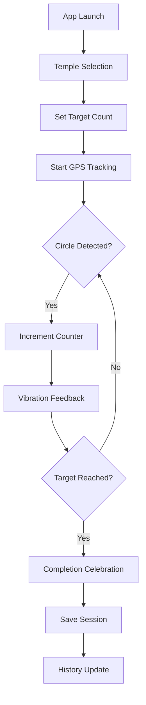

## 1. Product Overview
A mobile application designed for Indian temple visitors to count pradakshana (circumambulations) around temples using GPS technology. The app provides spiritual guidance with automated circle detection, cultural significance awareness, and user-friendly counting features for devotees performing this sacred ritual.

The app solves the problem of manually counting pradakshanas while maintaining spiritual focus, helping devotees track their religious commitments with accuracy and reverence.

## 2. Core Features

### 2.1 User Roles
| Role | Registration Method | Core Permissions |
|------|---------------------|------------------|
| Devotee | Phone number/Email optional | Count pradakshanas, view history, basic settings |
| Guest User | No registration required | Basic counting, limited history |

### 2.2 Feature Module
The temple pradakshana counting app consists of the following main pages:
1. **Counting Screen**: GPS tracking, circle detection, quick selection buttons, start/stop controls
2. **History Page**: Previous pradakshana sessions, statistics, achievements
3. **Settings Page**: Language selection, vibration preferences, temple database
4. **Temple Selection**: Nearby temples, search functionality, manual temple addition

### 2.3 Page Details
| Page Name | Module Name | Feature description |
|-----------|-------------|---------------------|
| Counting Screen | GPS Circle Detection | Real-time location tracking to detect completed circles around temple with 5-meter accuracy |
| Counting Screen | Quick Count Buttons | One-tap selection for traditional counts: 1, 3, 5, 9, 11, 108 pradakshanas |
| Counting Screen | Progress Display | Visual counter showing current count vs target, circular progress indicator |
| Counting Screen | Start/Stop Controls | Large, easy-to-tap buttons for session management with pause functionality |
| Counting Screen | Vibration Feedback | Customizable vibration patterns: single pulse per circle, triple pulse for final completion |
| History Page | Session History | Chronological list of completed pradakshana sessions with date, temple name, count achieved |
| History Page | Statistics | Total lifetime counts, average per session, longest streak, temple visit frequency |
| Settings Page | Language Toggle | Switch between Hindi and English with cultural terminology preservation |
| Settings Page | Vibration Settings | Enable/disable vibration, adjust intensity, customize completion patterns |
| Settings Page | Temple Database | Pre-loaded popular temples, add custom temples, GPS coordinates validation |
| Temple Selection | Nearby Temples | GPS-based temple suggestions within 2km radius |
| Temple Selection | Search Function | Find temples by name, deity, or location with auto-complete |

## 3. Core Process
**Devotee Flow:**
1. User opens app at temple premises
2. App suggests nearby temples or user selects manually
3. User sets target pradakshana count using quick buttons or custom input
4. User taps "Start Pradakshana" to begin GPS tracking
5. App detects circle completion through GPS coordinates and increments counter
6. Phone vibrates subtly on each completed circle
7. On final pradakshana, special vibration pattern and completion sound
8. Session automatically saves to history with timestamp and temple details

**Guest User Flow:**
Same as above but without session history persistence beyond current day

## 4. User Interface Design

### 4.1 Design Style
- **Primary Colors**: Saffron (#FF6B35) and Maroon (#8B0000) - traditional temple colors
- **Secondary Colors**: Gold (#FFD700) and Cream (#FFF8DC) - auspicious elements
- **Button Style**: Large, rounded rectangles with subtle shadows for easy tapping
- **Font**: Noto Sans for English, Noto Sans Devanagari for Hindi
- **Layout Style**: Card-based design with spiritual motifs (lotus, om symbols)
- **Icons**: Traditional Indian religious symbols in minimalistic style

### 4.2 Page Design Overview
| Page Name | Module Name | UI Elements |
|-----------|-------------|-------------|
| Counting Screen | Main Counter | Large circular display (200px) with current count in center, target count below, animated progress ring |
| Counting Screen | Quick Buttons | 6 large buttons (80x80px) arranged in 2 rows, saffron background with white text, subtle elevation |
| Counting Screen | GPS Status | Small indicator showing GPS accuracy with green/yellow/red status, temple name display |
| History Page | Session Cards | White cards with gold borders, showing date, temple name, count achieved, duration |
| Settings Page | Language Toggle | Traditional toggle switch with Hindi/English labels, cultural icon indicators |

### 4.3 Responsiveness
- **Mobile-first design** optimized for 5-6.5 inch screens
- **Touch-optimized** with minimum 48px tap targets
- **Portrait orientation** primary with landscape support for tablets
- **Accessibility features**: Large text mode, high contrast option, screen reader support