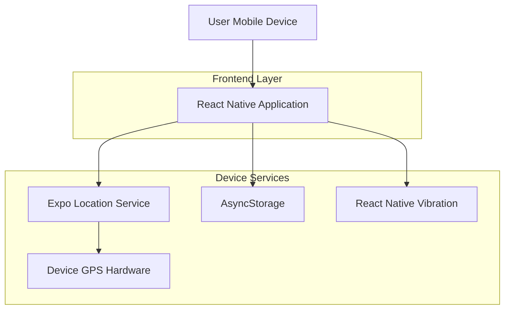
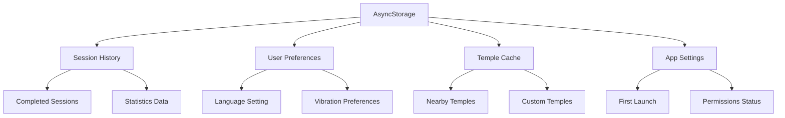

## 1. Architecture design



## 2. Technology Description

- **Frontend**: React Native@0.72 + Expo@49 + TypeScript
- **State Management**: React Context API + useReducer
- **Location Services**: expo-location@16.0
- **Storage**: AsyncStorage@1.19 for local data persistence
- **UI Framework**: React Native Elements@3.4 + Custom Components
- **Internationalization**: i18n-js@4.3
- **Backend**: None (offline-first approach with local storage)

## 3. Route definitions

| Route | Purpose |
|-------|---------|
| /counting | Main counting screen with GPS tracking and circle detection |
| /history | Session history and statistics display |
| /settings | Language, vibration, and app preferences |
| /temple-selection | Temple search and selection interface |
| /onboarding | Initial app tutorial and permissions setup |

## 4. Core Components Architecture

### 4.1 Location Tracking Service
```typescript
interface LocationTrackingService {
  startTracking(): Promise<void>
  stopTracking(): void
  onCircleComplete(callback: (count: number) => void): void
  getCurrentAccuracy(): number
}
```

### 4.2 Circle Detection Algorithm
```typescript
interface CircleDetectionConfig {
  minimumRadius: number // 15 meters minimum temple circumference
  accuracyThreshold: number // 5 meters GPS accuracy required
  completionThreshold: number // 80% of circle completion
  stationaryTimeout: number // 30 seconds before auto-pause
}
```

### 4.3 Vibration Patterns
```typescript
interface VibrationPatterns {
  singlePulse: number[] // [200] - 200ms vibration
  triplePulse: number[] // [200, 100, 200, 100, 200] - completion pattern
  errorPulse: number[] // [100, 100, 100] - GPS lost/error
}
```

### 4.4 Data Models

**Session Data:**
```typescript
interface PradakshanaSession {
  id: string
  templeName: string
  templeCoordinates: { latitude: number; longitude: number }
  targetCount: number
  achievedCount: number
  startTime: Date
  endTime: Date
  duration: number // in seconds
  completedCircles: Array<{
    timestamp: Date
    coordinates: { latitude: number; longitude: number }
  }>
}
```

**Temple Information:**
```typescript
interface Temple {
  id: string
  name: string
  nameHindi: string
  deity: string
  coordinates: { latitude: number; longitude: number }
  address: string
  popularCounts: number[] // [1, 3, 5, 9, 11, 108]
  verified: boolean
}
```

## 5. Local Storage Architecture



## 6. Circle Detection Algorithm Implementation

### 6.1 GPS Coordinate Tracking
- Continuous location updates every 2 seconds during active session
- Store coordinate trail with timestamp for path reconstruction
- Calculate distance from starting point using Haversine formula
- Detect when user returns to starting area (within 5-meter radius)

### 6.2 Path Validation
- Minimum path length: 30 meters (prevents false positives)
- Maximum deviation: 20 meters from ideal circle path
- Time threshold: 30 seconds minimum per circle (prevents GPS jumping)
- Direction consistency: Must maintain clockwise/counter-clockwise direction

### 6.3 Error Handling
- GPS accuracy monitoring: Pause tracking if accuracy > 10 meters
- Signal loss detection: Auto-pause after 30 seconds without GPS fix
- Battery optimization: Reduce update frequency when battery < 20%
- Background restrictions: Warn user about OS-level battery optimizations

## 7. Performance Considerations

### 7.1 Battery Optimization
- GPS sampling rate: 0.5 Hz during active counting (every 2 seconds)
- Location services pause when stationary > 30 seconds
- Batch coordinate storage to minimize AsyncStorage writes
- Reduce UI re-renders using React.memo and useMemo hooks

### 7.2 Memory Management
- Limit coordinate trail storage to current session only
- Clear old sessions automatically after 90 days
- Use FlatList for history rendering with windowSize optimization
- Implement coordinate compression for long sessions (>50 circles)

### 7.3 Offline Functionality
- Complete offline operation with local storage
- Temple database pre-loaded with 500+ popular temples
- Manual temple addition with coordinate validation
- Deferred sync when network available (future enhancement)

## 8. Security and Privacy

### 8.1 Data Protection
- All location data stored locally on device
- No server communication or data transmission
- Optional location permission with user consent
- Clear data option in settings menu

### 8.2 Permission Handling
- Request location permission on first app launch
- Explain permission necessity with cultural context
- Graceful degradation without precise location (manual counting mode)
- Background location permission for extended sessions